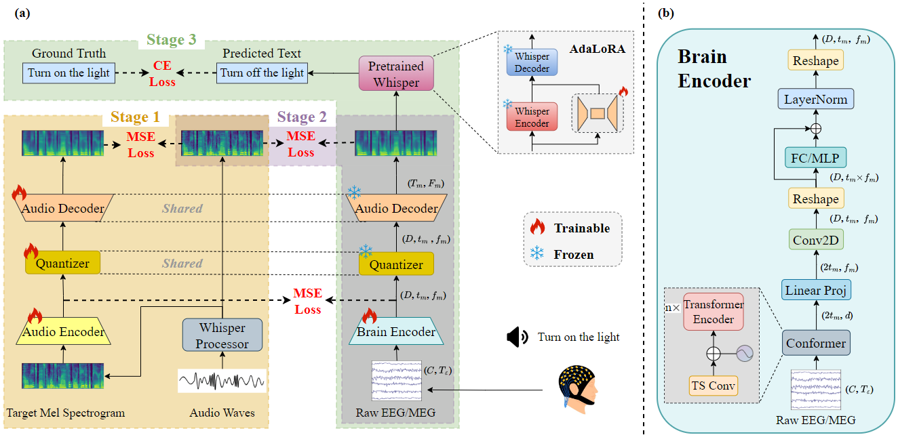

# BrainECHO: Semantic Brain Signal Decoding through Vector-Quantized Spectrogram Reconstruction for Whisper-Enhanced Text Generation

**BrainECHO** (<font color='blue'>https://arxiv.org/abs/2410.14971</font>) is a novel three-stage (autoencoding-alignment-finetuning) decoding framework for open-vocabulary EEG/MEG-to-text translation. [**Findings of ACL 2025**]



## Data Download and Preprocessing

First, download the Brennan dataset from https://deepblue.lib.umich.edu/data/concern/data_sets/bg257f92t and save it to a designated folder. Next, modify the data path in the code under `./preprocess/Brennan` accordingly, and then execute the preprocessing script: `bash ./preprocess/Brennan/process_Brennan.sh`

Similarly, download the GWilliams dataset from https://osf.io/ag3kj/ and save it to another folder. Update the data path in the code under `./preprocess/GWilliams`, and then run the following script: `bash ./preprocess/GWilliams/process_GWilliams.sh`

## Training and Evaluation

The three-stage training and evaluation process for the Brennan dataset can be conducted as follows:

Mel Spectrogram AutoEncoding:

```shell
python train_decoding_eeg_2_text_Brennan_Gwilliams_dataset_mel_vqvae_pretrain.py -c config/Brennan_dataset_train_mel_vqvae_pretrain.yaml --dataset Brennan
```

Brain-Audio Alignment and Whisper Finetuning:

```shell
python train_decoding_eeg_2_text_Brennan_dataset.py -c config/Brennan_dataset_train.yaml \
--dataset_path /home/szx/eeg2text/datasets/Brennan/split_by_subject/ \
--save_path ./checkpoints/whisper_decoding/Brennan_dataset/Brennan_dataset_split_by_subject-4040-1e-4
```

Model Evaluation:

```shell
python eval_decoding_eeg_2_text_Brennan_dataset.py -c config/Brennan_dataset_test.yaml \
--dataset_path /home/szx/eeg2text/datasets/Brennan/split_by_subject/ \
--eeg2text_checkpoint ./checkpoints/whisper_decoding/Brennan_dataset/Brennan_dataset_split_by_subject-4040-1e-4/b16_40_0.0001_finetune.pt \
--text_rusults Brennan_dataset_split_by_subject_result
```

For the GWilliams dataset, the training commands are as follows:

Mel Spectrogram AutoEncoding:

```shell
python train_decoding_eeg_2_text_Brennan_Gwilliams_dataset_mel_vqvae_pretrain.py -c config/Gwilliams_dataset_train_mel_vqvae_pretrain.yaml --dataset gwilliams
```

Brain-Audio Alignment and Whisper Finetuning:

```shell
python train_decoding_meg_2_text_Gwilliams_dataset.py -c config/Gwilliams_dataset_train.yaml --split split1 \
--save_path ./checkpoints/whisper_decoding/meg_dataset/meg_dataset-split1-4040-1e-4
```

Model Evaluation:

```shell
python eval_decoding_meg_2_text_gwilliams_dataset.py -c config/Gwilliams_dataset_test.yaml \
--eeg2text_checkpoint ./checkpoints/whisper_decoding/meg_dataset/meg_dataset-split1-4040-1e-4/b16_40_0.0002_finetune.pt \
--text_rusults meg_dataset_split1_result
```

The Brennan dataset above uses a subject-based splitting strategy, while the GWilliams dataset employs random shuffling. To assess model performance across different splitting strategies, run the full pipeline using: `bash run.sh`
